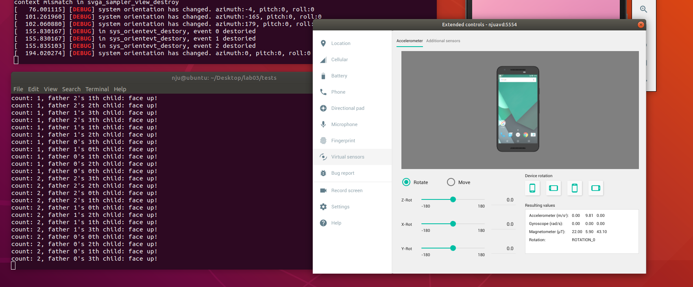
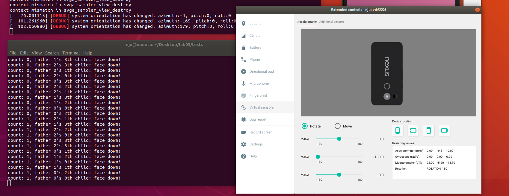
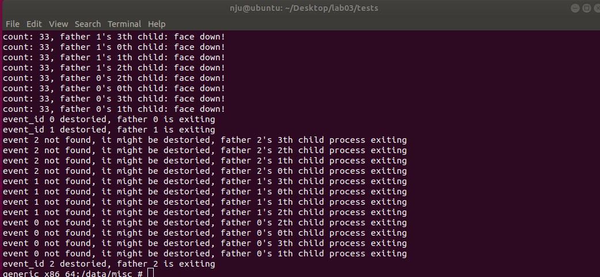

# Lab02: Android/Linux Process Tree

在本次实验中, 在内核代码中添加了要求的4个系统调用, 在Android虚拟机上测试系统调用

``` {.c bgcolor="bg"}
lab03
├── kernel
│   └── ...
├── orientd
│   ├── include
│   │   └── ...
│   ├── lib
│   │   └── libhardware.so
│   ├── Makefile
│   ├── orientd
│   ├── orientd.c   // 获取系统当前方向信息并写入系统内核中
│   ├── orientd.h
│   └── orientd.o
├── README.md
└── tests
    ├── facedown
    ├── facedown.c  // 3个父进程各fork出4个子进程并检测facedown事件
    ├── facedown.o
    ├── face.h
    ├── faceup
    ├── faceup.c    // 3个父进程各fork出4个子进程并检测faceup事件
    ├── faceup.o
    └── Makefile


```

## 添加系统调用
-----------------------

添加的系统调用代码如下

``` {.c bgcolor="bg"}
static struct dev_orientation sys_orient;                 // store the orient of system
static struct list_head event_head=(struct list_head){ &(event_head), &(event_head) };
static int curr_id=0;
static DEFINE_RWLOCK(lock);            // define rw lock

/* syscall number 326 */
asmlinkage int sys_set_orientation(struct dev_orientation *orient)
{
    int isChanged = 0;
    struct dev_orientation _orient;
    struct orient_event *evt;
    if (copy_from_user(&_orient, orient, sizeof(struct dev_orientation))){
        printk(KERN_ERR "[DEBUG] in sys_set_orientation, copy_from_user failed!\n");
        return -EFAULT;
    }
    if (sys_orient.azimuth != _orient.azimuth ||
        sys_orient.pitch != _orient.pitch ||
        sys_orient.roll != _orient.roll)
        isChanged = 1;

    write_lock(&lock);
    sys_orient.azimuth = _orient.azimuth;
    sys_orient.pitch = _orient.pitch;
    sys_orient.roll = _orient.roll;
    write_unlock(&lock);

    if (isChanged)
        printk(KERN_INFO "[DEBUG] system orientation has changed. azimuth:%d, pitch:%d, roll:%d\n",
               sys_orient.azimuth, sys_orient.pitch, sys_orient.roll);

    read_lock(&lock);
    list_for_each_entry(evt, &event_head, list){                        // 遍历队列中事件，并唤醒符合条件的事件
        if (orient_within_range(&sys_orient, &evt->o_range)){
            wake_up(&evt->wait_queue);
        }
    }
    read_unlock(&lock);

    return 0;
}


/*
* Create a new orientation event using the specified orientation range.
* Return an event_id on success and appropriate error on failure.
* System call number 327.
*/
asmlinkage int sys_orientevt_create(struct orientation_range *orient)
{
    struct orient_event *event;
    //struct orient_event *prev;
    if ((event = (struct orient_event *)kmalloc(sizeof(struct orient_event), GFP_KERNEL)) == NULL){
        printk(KERN_ERR "[DEBUG] kmalloc failed!\n");
        return -ENOMEM;
    }
    if (copy_from_user(&event->o_range, orient, sizeof(struct orientation_range))){
        printk(KERN_ERR "[DEBUG] in sys_orientevt_create, copy_from_user failed!\n");
        return -EFAULT;
    }

    write_lock(&lock);
    INIT_LIST_HEAD(&event->list);
    init_waitqueue_head(&event->wait_queue);
    event->is_alive=1;
    list_add(&event->list, &event_head);                  // 将新事件添加到队列中
    event->id=curr_id++;
    write_unlock(&lock);

    return event->id;
}

/*
* Destroy an orientation event and notify any processes which are
* currently blocked on the event to leave the event.
* Return 0 on success and appropriate error on failure.
* System call number 328.
*/
asmlinkage int sys_orientevt_destroy(int event_id)
{
    int id;
    struct orient_event *evt;
    id = event_id;

    write_lock(&lock);
    list_for_each_entry(evt, &event_head, list){
        if (evt->id == id){
            evt->is_alive=0;
            list_del(&evt->list);         // 删除事件
            kfree(evt);
            write_unlock(&lock);
            printk(KERN_INFO "[DEBUG] in sys_orientevt_destory, event %d destoried\n", id);
            return 0;
        }
    }
    write_unlock(&lock);

    return -EFAULT;   // not found
}

/*
* Block a process until the given event_id is notified. Verify that the
* event_id is valid.
* Return 0 on success and appropriate error on failure.
* System call number 329.
*/
asmlinkage int sys_orientevt_wait(int event_id){
    int id;
    struct orient_event *evt;
    int found=1;
    DEFINE_WAIT(wait);
    id = event_id;

    list_for_each_entry(evt, &event_head, list){
        if (id == evt->id){
            found=0;
            prepare_to_wait(&evt->wait_queue, &wait, TASK_INTERRUPTIBLE);
            if (evt->is_alive == 1){
                schedule();
            }
            finish_wait(&evt->wait_queue, &wait);
            break;
        }
    }

    return found;
}
```
`orientd.h`头文件内容为:

```{.c bgcolor="bg"}
#ifndef _ORIENTD_H
#define _ORIENTD_H

#include <asm/unistd.h>
#include <asm-generic/syscall.h>
#include <linux/wait.h>
#include <linux/list.h>
#include <linux/types.h>

#define __NR_set_orientation 326

struct dev_orientation {
    int azimuth; /* rotation around
    *  the X axis (-180<=azimuth<180)
    */
    int pitch;   /* rotation around the Y-axis: -90<=pitch<=90 */
    int roll;    /* rotation around Z-axis: +Y == -roll, -180<=roll<=180 */
};

/* syscall wrapper */
static inline int set_orientation(struct dev_orientation *orient)
{
    //return syscall(__NR_set_orientation, orient);
    return 1;
}

struct orientation_range {
    struct dev_orientation orient; /* device orientation */
    unsigned int azimuth_range; /* +/- degrees around X-axis */
    unsigned int pitch_range; /* +/- degrees around Y-axis */
    unsigned int roll_range; /* +/- degrees around Z-axis */
};

static inline int charon_abs(int n)
{
    return n>0?n:-n;
}

struct orient_event{
    unsigned int id;
    int is_alive;  
    struct orientation_range o_range;
    struct list_head list;
    wait_queue_head_t wait_queue;
};


//static struct dev_orientation sys_orient; // store the orient of system

/* Helper function to determine whether an orientation is within a range. */
static inline int orient_within_range(struct dev_orientation *orient,struct orientation_range *range)
{
    struct dev_orientation *target = &range->orient;
    unsigned int azimuth_diff = charon_abs(target->azimuth - orient->azimuth);
    unsigned int pitch_diff = charon_abs(target->pitch - orient->pitch);
    unsigned int roll_diff = charon_abs(target->roll - orient->roll);
    return (!range->azimuth_range || azimuth_diff <= range->azimuth_range
            || 360 - azimuth_diff <= range->azimuth_range)
            && (!range->pitch_range || pitch_diff <= range->pitch_range)
            && (!range->roll_range || roll_diff <= range->roll_range
            || 360 - roll_diff <= range->roll_range);
}

#endif
```

## 测试设计
使用了3个父进程，每个父进程调用`sys_orientevt_create`系统调用创建一个新的方向事件，得到一个唯一的`event_id`, 然后调用`fork`函数4次fork出4个子进程并监听同一个方向事件, 以`faceup.c`为例

```{.c bgcolor="bg"}
#include <unistd.h>
#include <stdio.h>
#include <stdlib.h>

#include "face.h"

struct orientation_range range = {{0, 0, 0}, 2, 2, 0};
const int child_number = 3;
const int child_child_number = 4;

int main()
{
    int event_id[3];
    for (int i = 0; i < child_number; i++){
        event_id[i] = orientevt_create(&range);
        for (int j = 0; j < child_child_number; j++){
            int c_pid = fork();
            if (c_pid < 0){
                printf("father %d's %dth child_child fork faild\n", i, j);
                return EXIT_FAILURE;
            }
            else if (c_pid == 0){
                for (int count = 0;; count++){
                    int event_wait = orientevt_wait(event_id[i]);
                    if (event_wait < 0){
                        printf("error occered when wait, father %d's %dth child process exiting\n", i, j);
                        return EXIT_FAILURE;
                    }
                    else if (event_wait == 0)
                        printf("count: %d, father %d's %dth child: face up!\n", count, i, j);
                    else{
                        printf("event %d not found, it might be destoried, father %d's %dth child process exiting\n", event_id[i], i, j);
                        return EXIT_SUCCESS;
                    }
                    sleep(1);
                }
            }
        }
    }
    sleep(60);
    for (int i = 0; i < child_number; i++){
        orientevt_destroy(event_id[i]);
        printf("event_id %i destoried, father %d is exiting\n", event_id[i], i);
    }
    return EXIT_SUCCESS;
}
```
## 测试结果:

先在Android虚拟机中运行守护进程`orientd`, 进程会进入后台运行, 然后执行`./facedown &`和`./faceup`同时运行两个程序。  
`faceup`:


`facedown`:


每个父进程在等待60s后会调用`sys_orientevt_destroy`系统调用摧毁当前事件，子进程会因为在等待队列中找不到对应事件而退出

